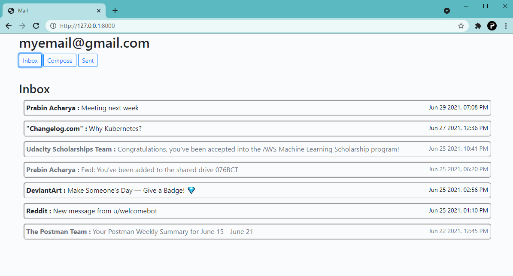
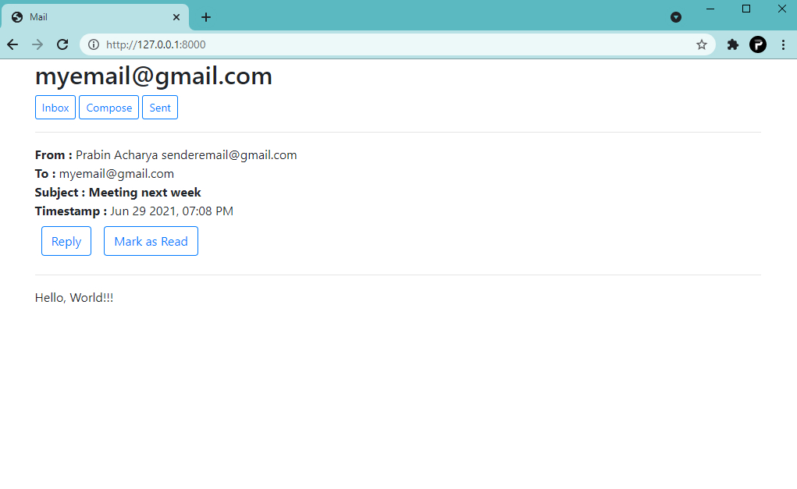
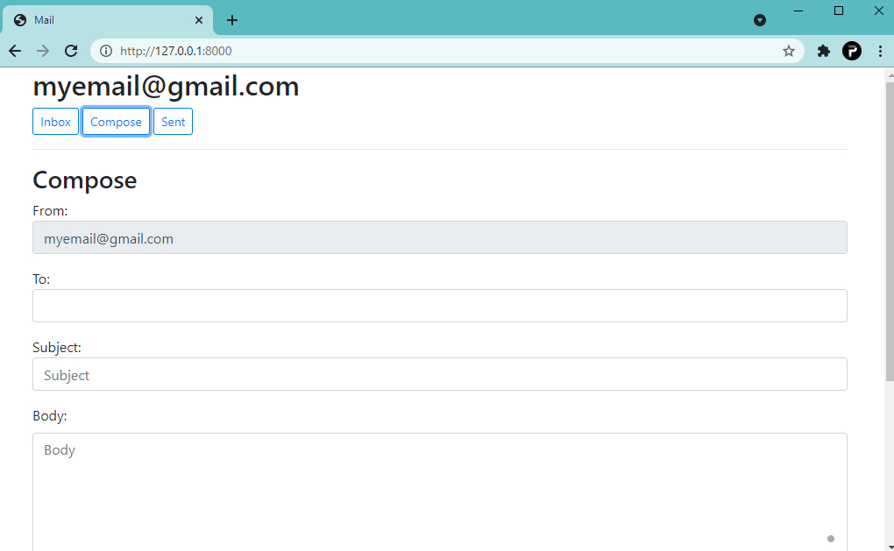
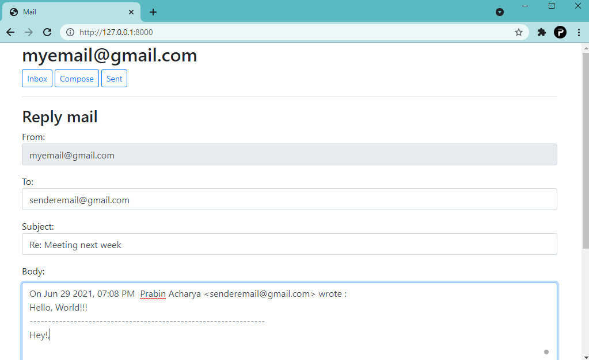

# mail-Gmail

mail-Gmail loads user's Gmail inbox and presents it in a clean UI by making API calls to send and receive emails.

It presents all of user's unread emails, sent emails and allows them to send and reply to emails using Gmail RESTful API.

I had the idea about this project when working on my another project [mail](https://github.com/prabin-acharya/mail) which allows users to sign in and send emails among users.

##Inbox

Lists all of the user's unread emails. Viewed emails are muted. "Sent": lists all of users sent emails.

##Mail

When clicked on any of the emails, it displays detail view of the email. Users can reply to the mail or Mark it as read.

##Compose

Users can send a new mail.

##Reply mail

Users can reply to mail which opens compose form with recipients and suubjects filled in.

